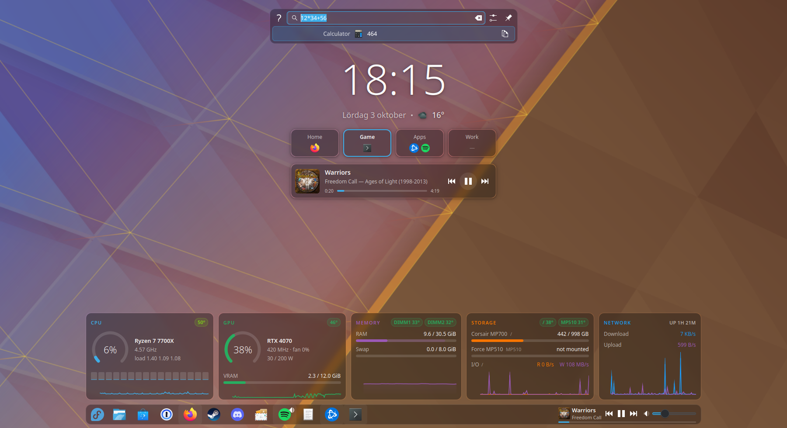
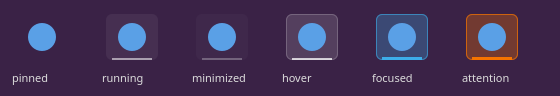
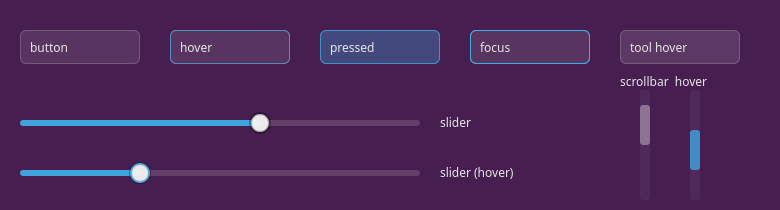

# Glass Panel

A minimal KDE Plasma 6 desktop theme: Breeze, with frosted-glass panels,
popups and tooltips. It is designed to match the glass look of the
[SysDash](https://github.com/zhelly0/sysdash) and
[DeskClock](https://github.com/zhelly0/deskclock) widgets.



Glass versions of these graphics replace Breeze's; everything else falls back
to Breeze:

| Graphic | Used for |
|---|---|
| `widgets/panel-background` | Panels (taskbar, top bar) |
| `dialogs/background` | Popups: application launcher, KRunner, calendar, system tray, notifications, OSDs |
| `widgets/tooltip` | Hover tooltips |
| `widgets/background`, `widgets/translucentbackground` | Widget backgrounds |
| `widgets/lineedit` | Text fields, e.g. the KRunner and launcher search boxes |
| `widgets/viewitem` | List highlights (hover / selected) in KRunner, the launcher, the tray |
| `widgets/tasks` | Taskbar buttons: running apps get an indicator bar (accent when focused, orange when asking for attention), so they stand out from pinned apps that aren't running |
| `widgets/plasmoidheading` | Popup headers and footers (a thin separator instead of a shaded bar) |
| `widgets/frame`, `widgets/tabbar`, `widgets/menubaritem` | Frames, active tabs, menu bar items |
| `widgets/button` | Buttons and tool buttons (normal, hover, pressed, focus) |
| `widgets/slider` | Sliders: track, filled part and handle (e.g. volume) |
| `widgets/scrollbar` | Scrollbars in Plasma popups |





The control graphics are derived from Breeze's own files: frame names and
padding hints are copied verbatim, so sizes and alignment match Breeze and only
the drawing changes.

Surfaces are rounded (12 px) frames with a thin outline and a tint of your
colour scheme's background; controls use 6 px corners and your accent colour for
highlights. Everything follows your colour scheme. KWin blurs what is
behind it. The tint is strong enough to keep light text readable even when a
white window is behind the glass (KWin 6 no longer has the background-contrast
effect that older themes relied on for this).

## Install

The folder name must match the theme id:

```sh
git clone https://github.com/zhelly0/glass-panel-theme ~/.local/share/plasma/desktoptheme/zhelly0-glass
plasma-apply-desktoptheme zhelly0-glass
```

Programs that were already running (e.g. KRunner) pick it up after a restart:
`systemctl --user restart plasma-plasmashell plasma-krunner`.

Revert with `plasma-apply-desktoptheme default`.

## Tweaking

Edit the values at the top of `generate.py` (tint, outline, corner radius,
padding), then regenerate and re-apply:

```sh
python3 generate.py
plasma-apply-desktoptheme default && plasma-apply-desktoptheme zhelly0-glass
```

## Recommended companion settings

These aren't part of a Plasma theme, but complete the look:

- **Smooth blur without grain** (measured to match the widgets' glass):
  `kwriteconfig6 --file kwinrc --group Effect-blur --key BlurStrength 3`,
  `kwriteconfig6 --file kwinrc --group Effect-blur --key NoiseStrength 0`, then
  `qdbus6 org.kde.KWin /Effects org.kde.kwin.Effects.reconfigureEffect blur`
- **Translucent app menus** (Breeze): System Settings → Colors & Themes →
  Application Style → Breeze → Transparency, about halfway
  (`breezerc`: `[Style] MenuOpacity=50`)

## Extras

### Konsole and Yakuake

`extras/konsole/` has a **Glass** colour scheme (Breeze colours, 80% opacity,
blur) and a profile using it. Terminal text is small, so it is denser than the
panel glass.

```sh
cp extras/konsole/Glass.* ~/.local/share/konsole/
kwriteconfig6 --file konsolerc --group "Desktop Entry" --key DefaultProfile Glass.profile
# Yakuake as a Flatpak keeps its own copy:
cp extras/konsole/Glass.* ~/.var/app/org.kde.yakuake/data/konsole/
kwriteconfig6 --file ~/.var/app/org.kde.yakuake/config/konsolerc --group "Desktop Entry" --key DefaultProfile Glass.profile
```

### Window title bars (Aurorae)

`extras/aurorae/` generates a **Glass** Aurorae decoration: blurred glass title
bars (same 50% tint as the panel, 10 px rounded top corners, 1 px border) and
round glass buttons; close turns red on hover. Aurorae themes use fixed
colours, so `generate.py` has Breeze Dark's values at the top.

```sh
python3 extras/aurorae/generate.py      # writes ~/.local/share/aurorae/themes/zhelly0-glass
kwriteconfig6 --file kwinrc --group org.kde.kdecoration2 --key library org.kde.kwin.aurorae
kwriteconfig6 --file kwinrc --group org.kde.kdecoration2 --key theme __aurorae__svg__zhelly0-glass
qdbus6 org.kde.KWin /KWin reconfigure
```

Blur needs the unprefixed `mask-*` frame in `decoration.svg`; Aurorae uses it
to tell KWin which area to blur. Revert in System Settings → Window
Decorations (pick Breeze).

## License

GPL-3.0, see [LICENSE](LICENSE).
